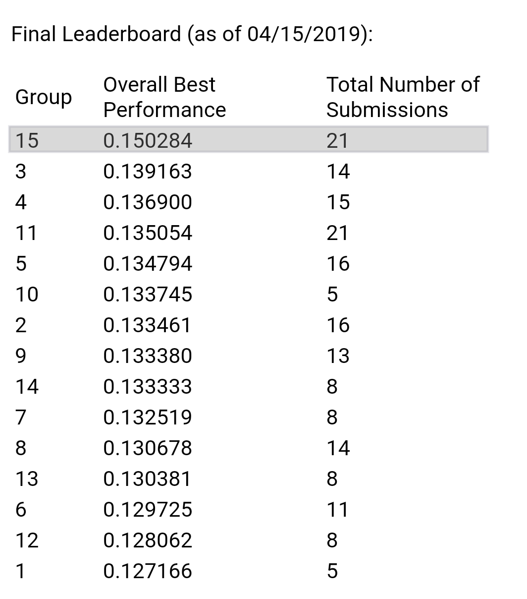

# Adopter-Prediction-Challenge

Imbalanced class classfication challenge on classifying likelihood adopters for a music streaming service.

Advisor - Dr. Mochen Yang ([mochenyang.github.io](https://mochenyang.github.io))

### Problem Statement

Website XYZ, a music-listening social networking website, follows the “freemium” business model. The website offers basic services for free, and provides a number of additional premium capabilities for a monthly subscription fee. We are interested in predicting which people would be likely to convert from free users to premium subscribers in the next 6 month period, if they are targeted by our promotional campaign.

### Task

The task is to build the best predictive model for the next marketing campaign, i.e., for predicting likely  `adopters`  (that is, which current non-subscribers are likely to respond to the marketing campaign and sign up for the premium service within 6 months after the campaign).

### Results

Challenge completed with first position, metrics:

| Metric | Value |
| ------ | ----- |
| `F1 score` | 0.15028|
| `Recall` | 0.24026|
| `Precision` | 0.10934|
| `Accuracy` | 0.95170|

Leaderboard, with number of submissions:

### Solution Approach

[approach.pdf](approach.pdf)

### Dataset

The labeled dataset contains 86,682 records, each record representing a different user of the XYZ website who was targeted in the previous marketing campaign. Each record is described with 25 attributes. Here is a brief description of the attributes (attribute name: type - description):

* `adopter`: binominal (0 or 1) - whether a user became a subscriber within the 6 month period after the marketing campaign (this is the outcome variable)
*  `user_id`: integer - whether a user became a subscriber within the 6 month period after the marketing campaign (this is the outcome variable)
* `age`: integer - age in years
* `friend_cnt`: integer - numbers of friends that the current user has
* `avg_friend_age`: real - average age of friends (in years)
* `avg_friend_male`: real (between 0 and 1) - percentage of males among friends
* `friend_country_cnt`: integer - number of different countries among friends of the current user
* `subscriber_friend_cnt`: integer - number of friends who are subscribers of the premium service
* `songsListened`: integer - total number of tracks this user listened (or reported as listened)
* `lovedTracks`: integer - total number of different songs that the user “liked”
* `posts`: integer - number of forum or discussion board posts made by the user
* `playlists`: integer - number of playlists created by the user
* `shouts`: integer - number of wall posts received by the user
* `good_country`: boolean - country type of the user: 0 – countries where free usage is more limited, 1 – less limited
* `tenure`: integer - number of months since the user has registered on the website
* `delta_<attrname>`: integer - Such attributes refer not to the overall number, but the change to the corresponding number over the 3-month period before the marketing campaign.

### Attempted algorithms

* k-NN
* Decision Tree (CART)
* Logistic Regression
* Support Vector Machine
* Random Forest
* Extra Trees Classifier
* LDA Classifier [https://scikit-learn.org/stable/modules](https://scikit-learn.org/stable/modules/generated/sklearn.discriminant_analysis.LinearDiscriminantAnalysis.html)
* Gradient Boosting
* XGBoost - [github.com/dmlc/xgboost](https://github.com/dmlc/xgboost)
* LightGBM - [github.com/microsoft/LightGBM](https://github.com/microsoft/LightGBM)
* Ensembles of above
* Neural Networks